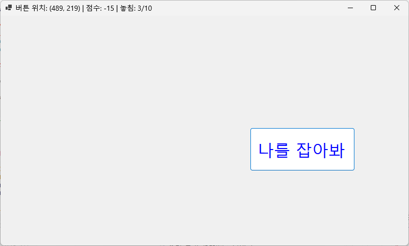
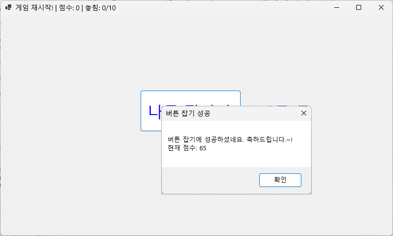
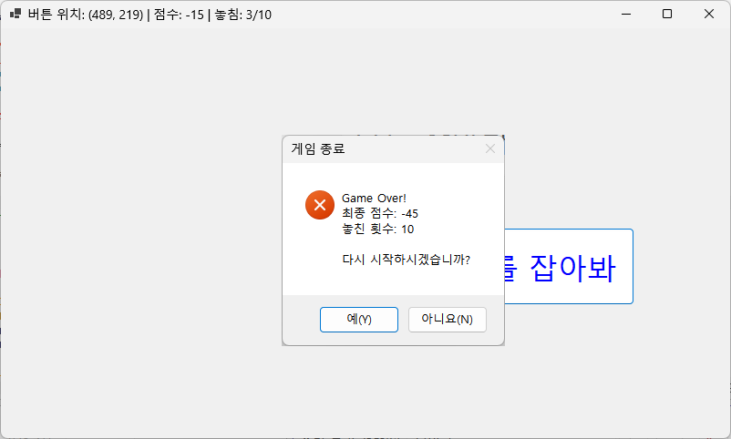

# (C# 코딩) 도망가는 버튼 잡기 

## 개요
- C# 프로그래밍 학습
- 1줄 소개: 버튼이 마우스가 다가오면 다른 곳으로 이동하는 게임 
- 사용한 플랫폼: 
  - C#, .NET Windows Forms, Visual Studio, GitHub
- 사용한 컨트롤:
  - Label, Button 
- 사용한 기술과 구현한 기능:
  - Visual Studio를 이용하여 UI 디자인 
  - Button 클래스의 속성 중 위치정보, 크기정보 활용
  - Button 클래스의 마우스 이벤트 구현

## 실행 화면
코드의 실행 스크린샷

- 목표 : 버튼 컨트롤 영역 안으로 마우스가 들어가면 버튼을 랜덤 위치로 이동
  - 내용 :
    - UI 구성. 버튼 컨트롤을 하나 만들고 Text를 “나를 잡아봐＂로 합니다. 
    - 버튼 이동 기능 구현. 마우스가 버튼 위로 이동하면 버튼의 위치를 변경해서 옮깁니다. 
    - 버튼 위치정보 표시. 폼 제목에 현재 버튼의 X, Y 좌표를 실시간으로 표시합니다.
    - 버튼 이동 범위 제한. 버튼이 화면 밖으로 나가는 경우를 방지합니다.

## 실행 화면
코드의 실행 스크린샷

- 목표 : 버튼을 잡으면 메시지 박스 열어서 축하메시지 표시
  - 내용 : 
    - 버튼을 잡았을 때 버튼을 클릭하면 “축하합니다~!” 라고 메시지 박스를 띄웁니다.
    - 이때 점수도 가점합니다.
    - 버튼을 놓치면 점수를 감점합니다.

## 실행 화면
코드의 실행 스크린샷

목표 : "Game Over" 표시하고 재도전 할 수 있도록 하기
  - 내용 : 
    - 20번 놓치면 "Game Over" 메시지를 출력하고 모든 버튼을 비활성화 처리합니다.
    - '다시 시작' 버튼을 구현하여 게임 관련된 모든 정보를 초기화 합니다. 처음 하는 것처럼 게임을 다시 시작합니다. 

